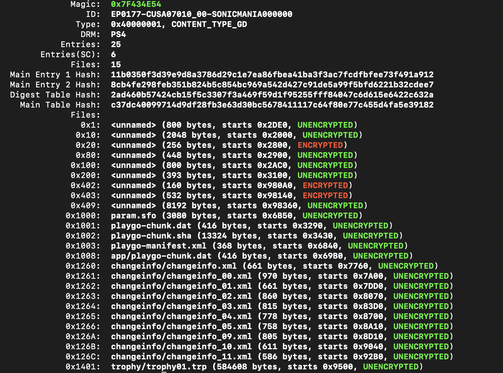

# ps4-pkgtools

Performs some read-only operations on PS4 .pkg files:

## Usage

### Extract

```
python3 main.py extract File.pkg --file 0x126C --out out.mxl
```

Extracts file with ID `0x126C` to `out.xml`. 
The argument to `--file` can be a file ID or filename 

### Info

```
python3 main.py info File.pkg
```

returns:Extracts everything to directory `extracted`



### Dump

```
python3 main.py dump File.pkg --out extracted
```

Extracts everything to directory `extracted`